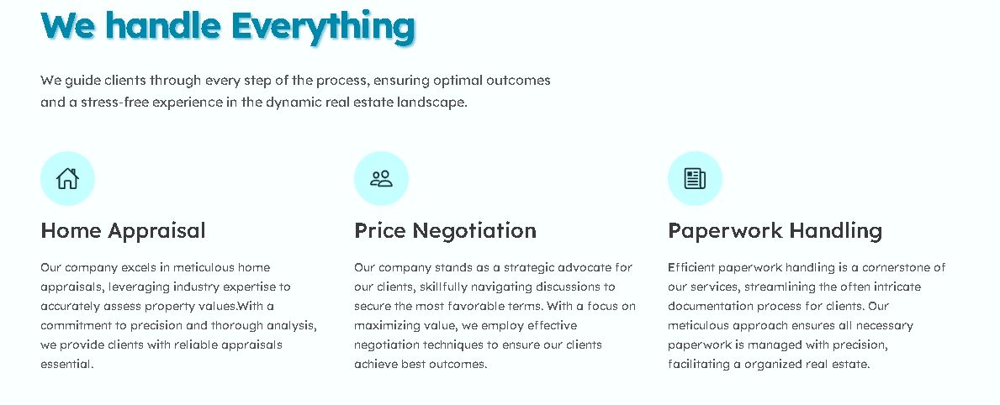
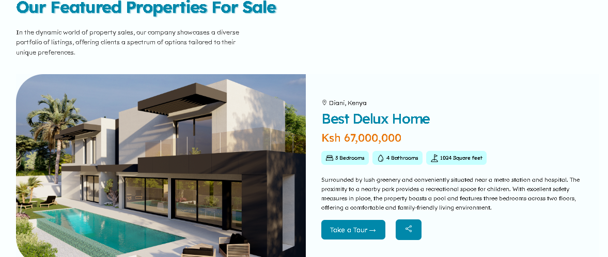
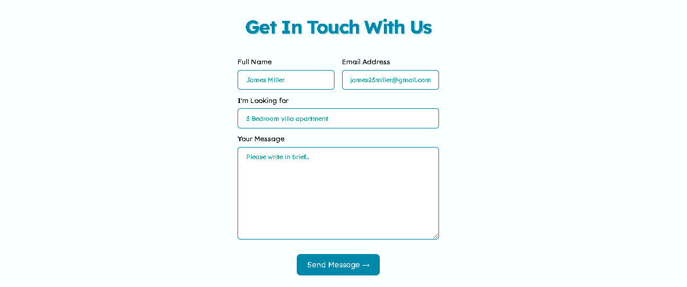

# Book Store

## Introduction

This is a simple and elegant landing page for a real estate project, built using HTML and CSS. The page is designed to showcase real estate properties and attract potential clients with a clean and modern design.

## thumbnail


## Features

- Clean Layout: A well-structured layout with sections for property listings, company information, and contact details.
- Modern UI: Uses a modern and appealing UI with subtle animations and transitions to engage visitors.

## Technologies Used

- HTML5: Markup language for structuring the content.
- CSS3: Styling the layout, colors, fonts, and animations.

## Installation

**1. Clone the repository**:

```
git clone https://github.com/youngniccurace/.git
cd landing-page
```

**2. Open the project**:
Open the `index.html` file in your preferred web browser to view the landing page.

## Project Structure

- `index.html`: Main HTML file containing the structure of the landing page.
- `styles.css`: CSS file containing styles for the landing page.
- `img/`: Folder containing images used on the landing page (e.g., property photos, logos).

## Sections

- **Hero Section**: Catchy headline and call-to-action button to grab the visitor's attention.
- **About Us**: Information about the real estate company and its services.
- **Property Listings**: Highlight featured properties with images and brief descriptions.
- **Testimonials**: Customer reviews and testimonials to build trust and credibility with potential clients.
- **Contact Section**: Contact details and a simple contact form for inquiries.

## Customization

- Update the content in `index.html` to match your real estate properties and company information.
- Modify `styles.css` to change the color scheme, fonts, and layout as needed.

## Website Link

Link: https://therealestatelandingpage.netlify.app/

## Screenshots

### **1. Hero Section**:


### **2. About Section**:



### **3. Properties Section**:



### **4. Testimonial Section**:


### **5. Contact Section**:


